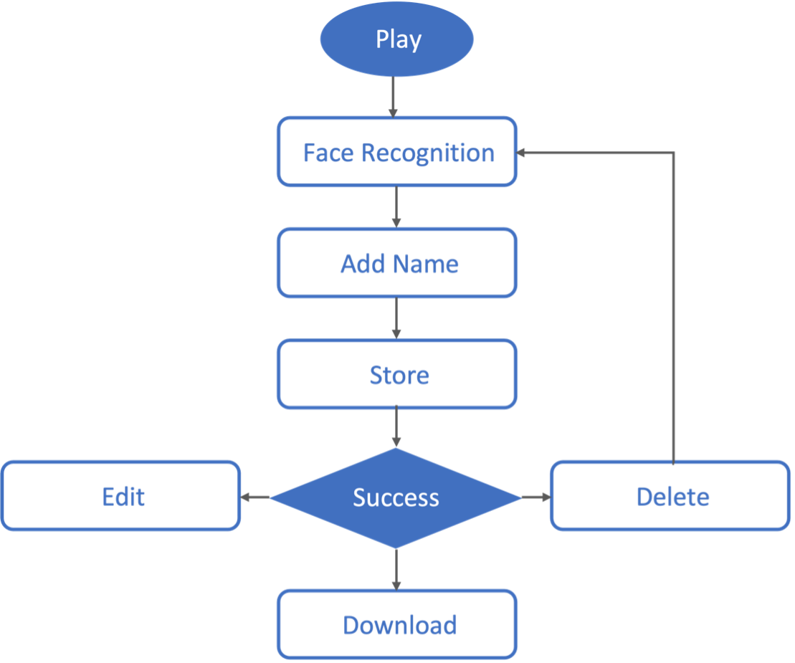

# Face Recognition Attendance System by Using TensorFlow.js on a Web Page

> __Web Application Frontend Requirements__

* Languages: JavaScript, HTML, CSS
* Library: React.js

 

> __Web Application Backend Requirements__

* Language: JavaScript
* Environment: Node.js
* Framework: Express
* API: REST API
* Database: 
    * MySQL / MariaDB
    * XAMPP (phpMyAdmin)
* Cloud: GCP (VM Instance: Ubuntu)

 

> __Face Recognition__

* TensorFlow.js
* face-api.js
* SSD MobileNet v1
* FaceLandmark68Net

 

> __Attendance System__

* CRUD (Create, Read, Update, and Delete)

 

___

 

### __The Workflow of Face Recognition__

___

 

### __The Workflow of This Application__

 

 

___

 

### __User Interface__

### __Results__

